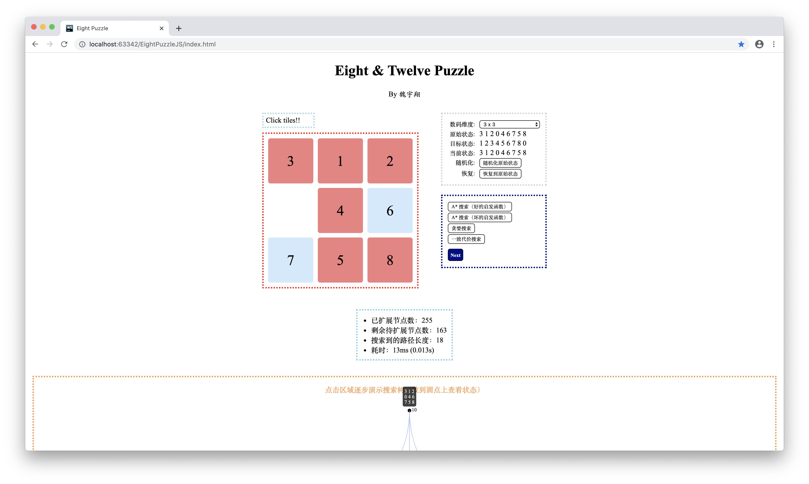

# Puzzle Game AI

> This repo features automatically solving the puzzle game. 
> And the end result is a webpage where JavaScript and especially its *d3.js* framework are
> used for implementation. 

**You can experiment with the functionalities directly in [this](universefly.github.io/EightPuzzleJS) website.**

## User Interface

## Core Functionalities

- Self playing by clicking tiles
- Animation for tiles movement
- Options on puzzle dimension
- Four kinds of searching algorithms
- Display of search result (e.g. time cost, expanded nodes, etc.)
- Display of search tree

## Acknowledgement

Thanks to [this](https://github.com/ljkojbk/EightDigitPuzzle) repo which gives me inspiration.
